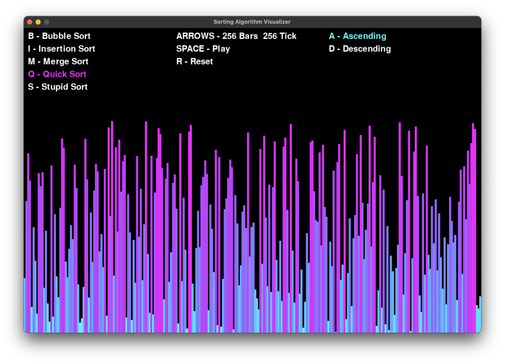
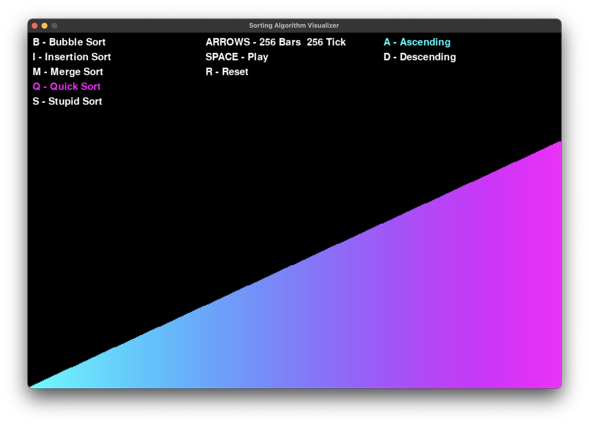

# Sorting Algorithm Visualizer

Python [program](visualizer.py) that visualizes different sorting algorithms.

Why my sorting algorithm visulaiser is unique:

- can sort ascending and descending
- can change algorithm, speed, and order on the fly while sorting
- can pause and play mid sort

## Algorithms

- Bubble Sort
- Insertion Sort
- Merge Sort
- Quick Sort
- Stupid Sort

## Requirements

- Pygame
