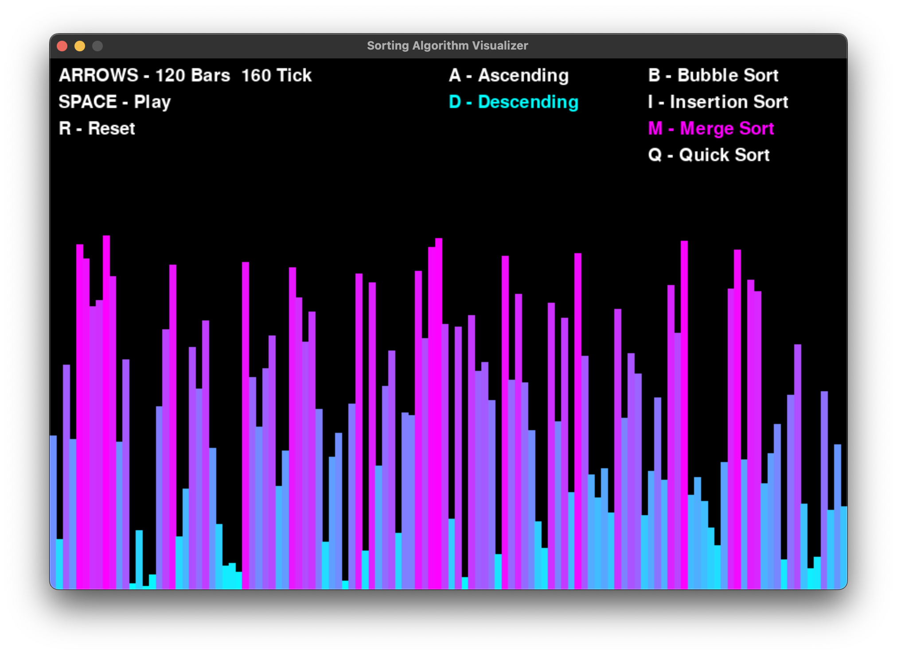
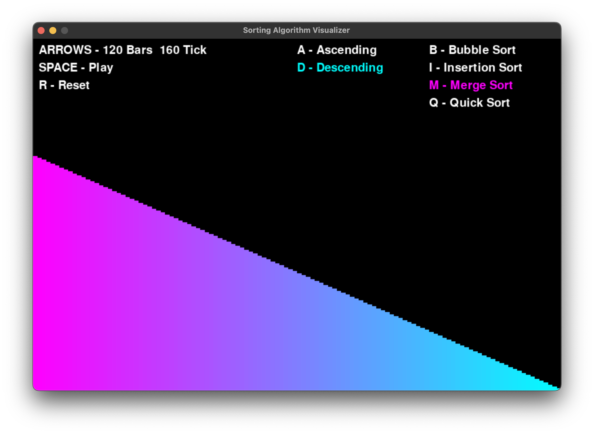

# Sorting Algorithm Visualizer

Python program that visualizes different sorting algorithms.

Can do this both Ascending and Descending!

## Algorithms

- Bubble Sort
- Insertion Sort
- Merge Sort
- Quick Sort

## Requirements

- Pygame
